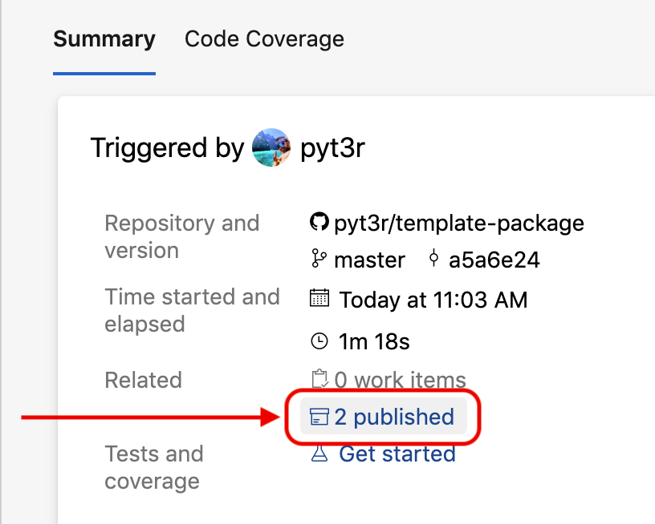
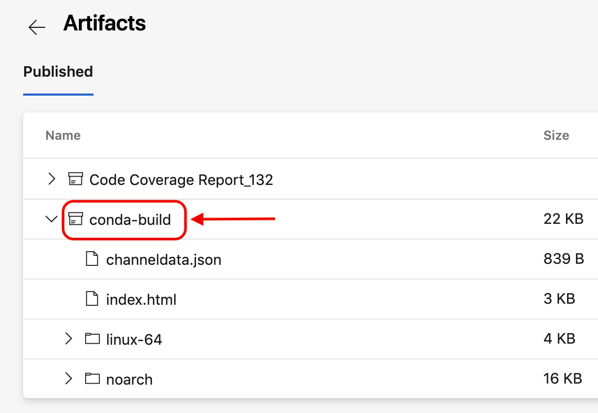

=============================================================
template-package : python + azure + conda + docs
=============================================================

The template-package is a sample repo for setting up CI pipelines.

.. badges

.. list-table::
    :stub-columns: 1
    :widths: 10 90

    * - docs
      - |docs|
    * - tests
      - |build| |coverage|
    * - package
      - |version| |platform| |downloads|

.. |docs| image:: https://readthedocs.org/projects/template-package/badge/?version=latest
    :target: https://template-package.readthedocs.io/en/latest/?badge=latest
    :alt: Docs

.. |build| image:: https://img.shields.io/azure-devops/build/pyt3r/template/3
    :alt: Build
    :target: https://dev.azure.com/pyt3r/template/_build

.. |coverage| image:: https://img.shields.io/azure-devops/coverage/pyt3r/template/3
    :alt: Coverage
    :target: https://dev.azure.com/pyt3r/template/_build

.. |version| image:: https://img.shields.io/conda/v/pyt3r/template
    :alt: Version
    :target: https://anaconda.org/pyt3r/template

.. |platform| image:: https://img.shields.io/conda/pn/pyt3r/template
    :alt: Platform
    :target: https://anaconda.org/pyt3r/template

.. |downloads| image:: https://img.shields.io/conda/dn/pyt3r/template
    :alt: Platform
    :target: https://anaconda.org/pyt3r/template

.. badges

.. contents:: :local:

Features
################

* invoke a simple `conda-build`_ recipe
* trigger a simple CI `Azure Pipeline`_ to build, test, and publish a conda package artifact, which can be uploaded to `Anaconda Cloud`_
* trigger and publish `Read the Docs`_ builds

.. _conda-build: https://docs.conda.io/projects/conda-build/en/latest/
.. _Azure Pipeline: https://dev.azure.com/pyt3r/template/_build
.. _Anaconda Cloud: https://anaconda.org/pyt3r/template
.. _Read the Docs: https://template-package.readthedocs.io

Prerequisites
################

* `(mini)conda`_
* python3.7
* Unix

.. _(mini)conda: https://docs.conda.io/en/latest/miniconda.html

Conda Build
################

1. Create and activate a conda environment::

    $ conda env create --name test-env --file ci/test-env-requirements.yml python=3.7
    $ conda activate test-env

2. Build and add the template package to the environment::

    (test-env) $ cd ..
    (test-env) $ mkdir conda-build
    (test-env) $ conda build template-package --output-folder=conda-build
    (test-env) $ conda install conda-build/**/template*.tar.bz2

3. Run the tests against the template package and view the report::

    (test-env) $ coverage run -m --include=**/template/* --omit=**/test_*.py unittest discover template-package/tests
    (test-env) $ coverage report -m
    (test-env) $ rm -r .coverage

4. (Optional) Test the entry point defined in `conda-recipe/meta.yaml`_::

    (test-env) $ template-entry-point

.. _conda-recipe/meta.yaml: conda-recipe/meta.yaml

5. (Optional) Upload the artifact (requires an Anaconda account)::

    (test-env) $ anaconda upload conda-build/**/template*.tar.bz2

6. (Optional) Deactivate::

    (test-env) $ conda deactivate
   
    $ echo "..and we're back to normal"

Azure Pipelines
################

Each commit (and PR) to the master branch invokes the `azure-pipelines.yml`_ script, which automates the Steps 1 through 3 above.

.. _azure-pipelines.yml: azure-pipelines.yml

The pipeline concludes by publishing the coverage report and conda package artifact on `Azure`_:

.. _Azure: https://dev.azure.com/pyt3r/template/_build

Artifact
################
Upon the conclusion of the pipeline, users may access and upload the published artifact (a conda package) to `Anaconda Cloud`_ where it may be installed as follows::

    $ conda install -c pyt3r template

Author
################

* ``pyt3r``

License
################

* `MIT License`_

.. _MIT License: LICENSE
